# GitFlow 기반 브랜치 전략 가이드

## 개요

이 문서에서는 GitFlow 디자인 패턴을 기반으로 한 브랜치 관리 전략을 설명합니다. GitFlow는 소프트웨어 개발 프로젝트에서 널리 사용되는 브랜치 관리 모델로, Vincent Driessen이 2010년에 소개하였습니다.

해당 라이브러리의 브랜치 전략은 "GitFlow"를 기본으로 하며, "GitHub Flow"와 "Conventional Commits"의 요소를 결합한 맞춤형 워크플로우입니다. 각 브랜치를 PR로 관리하여 프로젝트 작업 내용을 명확하게 파악하고, `dev` 및 `main` 브랜치에 일관성 있는 통합을 가능하게 합니다.

### 주요 특징

- 메인 브랜치(`main`)와 개발 브랜치(`dev`)를 분리하여 운영
- 기능별로 브랜치(`feat/*`)를 생성하고 개발 완료 후 개발 브랜치에 병합
- 릴리즈 브랜치(`release/*`)를 통해 개발 브랜치의 내용을 메인 브랜치로 병합
- 버그 수정(`fix/*`), 리팩토링(`refactor/*`) 등 목적에 따른 브랜치 네이밍 규칙 적용
- 커밋 메시지 컨벤션(feat, fix, docs 등)과 PR 기반 작업 방식 통합
- AutoPR 도구를 통한 작업 흐름 자동화

## AutoPR 설치 및 설정

AutoPR 도구를 사용하기 위해서는 다음 단계를 따라 설치 및 설정해야 합니다:

1. NPM을 통해 전역으로 설치:
   ```bash
   npm install -g newexpand-autopr // * 반드시 npm으로 진행해주세요.
   ```

2. 프로젝트에서 초기 설정 실행:
   ```bash
   autopr init
   ```
   위 명령어를 실행하면 대화형 프롬프트가 나타나며, 프로젝트의 기본 브랜치(main, dev 등)와 브랜치 패턴 설정이 가능합니다.

   초기 설정 과정에서는 다음과 같은 옵션도 선택할 수 있습니다:
   - GitHub 인증 (OAuth 또는 수동 토큰 입력)
   - 기본 브랜치와 개발 브랜치 설정
   - AI 기능 설정 (OpenAI 또는 OpenRouter)
     - OpenAI: API 키 값이 필요하며, 유료로 사용됩니다.
     - OpenRouter: 별도의 키 설정 없이 무료로 사용 가능합니다.
   - GitHub Actions 워크플로우 자동 설정 (PR 자동 리뷰용)
     - PR이 생성되거나 업데이트될 때 자동으로 코드 리뷰 수행
     - PR의 코드 품질, 잠재적 버그, 보안 취약점 등 분석
     - 특정 코드 라인에 인라인 코멘트 제공
     - 사용자 로케일에 맞는 다국어 리뷰 제공

   ### 초기 설정(init) 실행 예시
   
   아래는 `autopr init` 명령어를 실행했을 때의 단계별 화면 예시입니다:
   
   #### a. GitHub 토큰 설정
   
   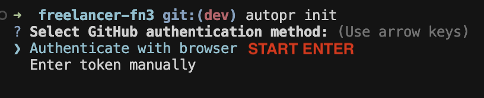
   *초기 설정 시작 - GitHub 토큰을 설정합니다. OAuth 인증이나 수동 토큰 입력 방식을 선택할 수 있습니다.*
   
   #### b. 깃허브 인증1
   
   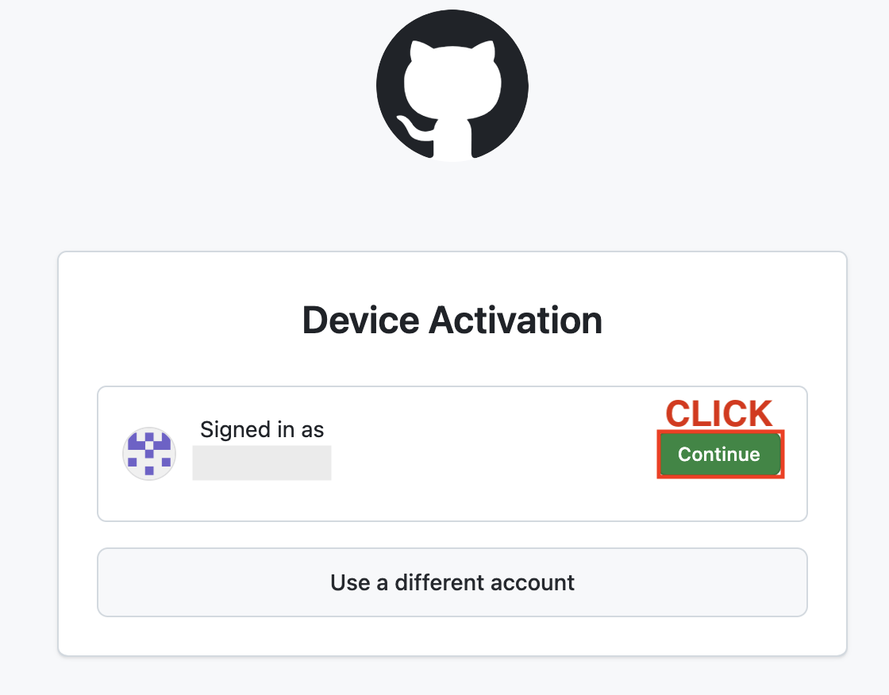
   *깃허브 인증 과정 입니다*
   
   #### c. 깃허브 인증2
   
   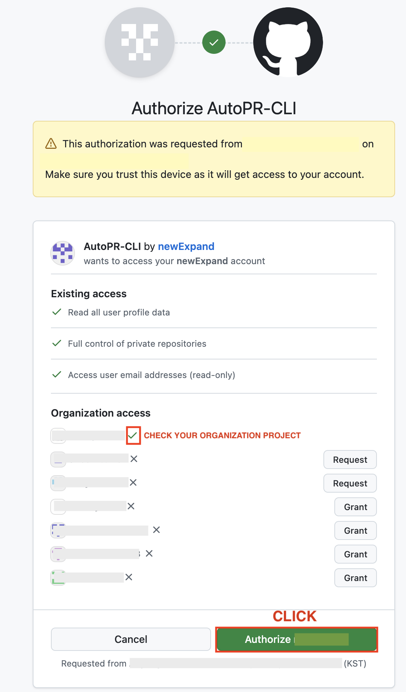
   *깃허브에서 Organization관련 레포는 접근이 허용되어야 합니다.(초록색 체크 표시 확인), 개인 레포는 클릭시 바로 사용 가능*
   
   #### d. 깃허브 인증3
   
   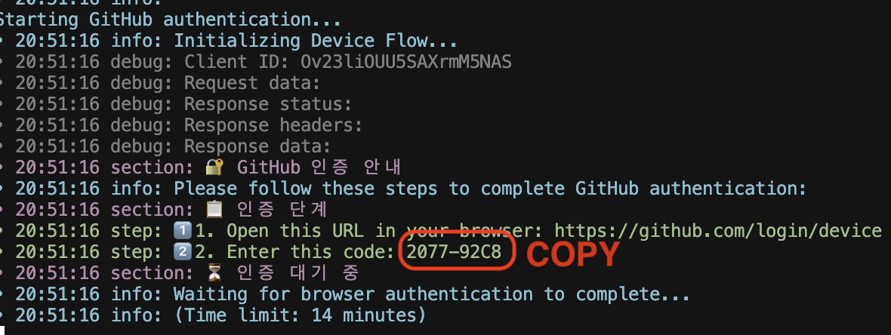
   *터미널에 있는 디바이스 코드를 복사 합니다*

   #### e. 깃허브 인증4
   
   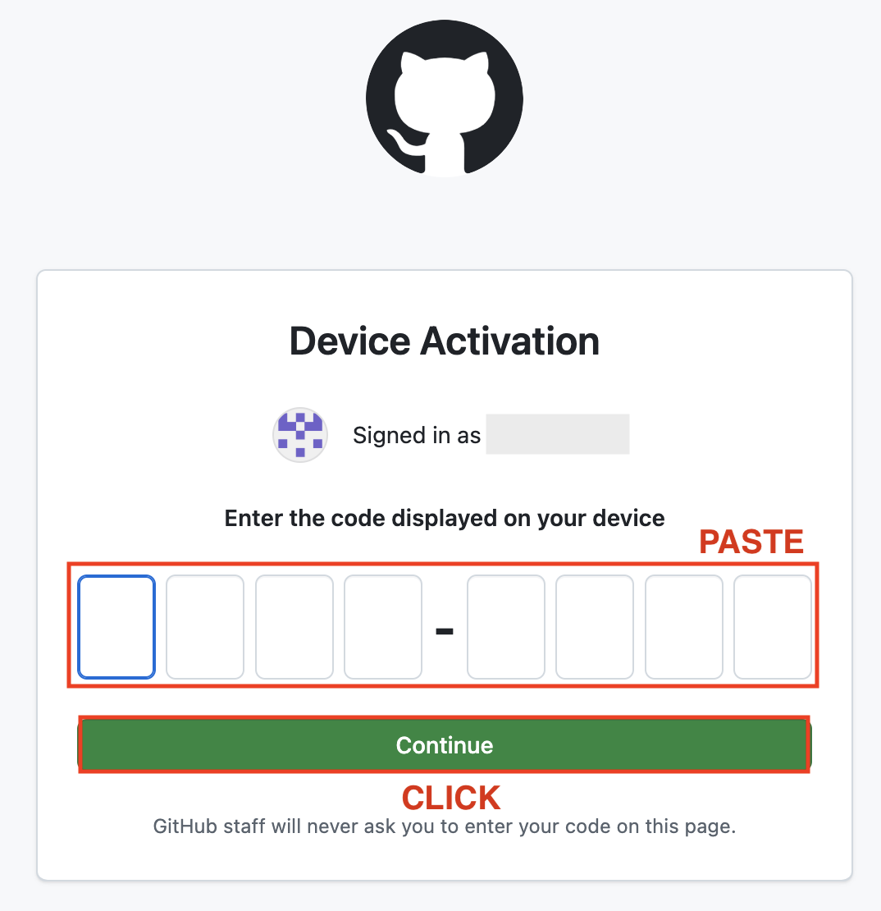
   *터미널에서 복사한 코드를 인증코드에 적용합니다*
   
   
   #### f. AutoPr 기본 세팅
   
   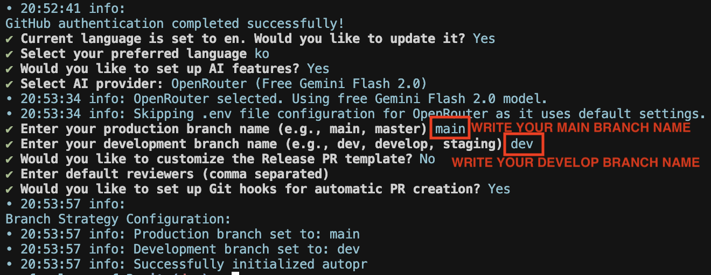
   *프로젝트의 기본 브랜치(main)와 개발 브랜치(dev) 설정, 릴리즈 PR 템플릿, 기본 리뷰어 등을 설정합니다.*
   
   #### g. 설정 완료
   
   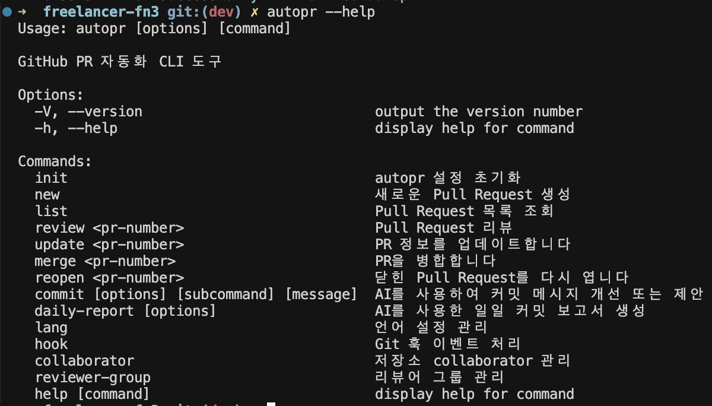
   *초기 설정이 성공적으로 완료되었습니다. 이제 AutoPR을 사용할 준비가 되었습니다.*

3. 버전 확인 및 업데이트:
   ```bash
   # 현재 설치된 버전 확인
   autopr --version
   
   # npm의 최신 버전 확인
   npm view newexpand-autopr version
   
   # 최신 버전으로 업데이트
   npm install -g newexpand-autopr@latest
   ```

> 💡 **참고**: 이전 버전을 사용 중이던 사용자도 위 명령어를 통해 최신 버전으로 업데이트할 수 있습니다.

## 기본 원칙

- 항상 `dev` 브랜치를 기준으로 개발 및 선적용
- 브랜치 단위의 기능이 완료될 때마다 `dev`에 통합
- 전체적인 기능이 완성되면 `main`에 통합
- PR 생성 전 항상 최신 `dev` 브랜치를 병합하여 충돌을 미리 해결
- 통합이 완료된 브랜치는 삭제하여 저장소를 깨끗하게 유지

## 브랜치 명명 규칙

`.autopr.json` 파일의 규칙에 따라 다음과 같은 형식을 사용합니다:

- `feat/*`: 새로운 기능 개발
- `fix/*`: 버그 수정
- `refactor/*`: 코드 리팩토링
- `docs/*`: 문서 수정
- `chore/*`: 기타 작업
- `test/*`: 테스트 관련 작업
- `release/*`: 릴리즈 준비

브랜치 생성 방법:
```bash
git checkout -b <브랜치명>
# 예시: git checkout -b feat/notice-object-a
```

> 💡 **참고**: 브랜치명이 길어질 경우 `-`를 사용하여 구분합니다.

## 사용 방법

### 표준 워크플로우

1. `dev` 브랜치에서 새 기능 브랜치 생성
   ```bash
   git checkout dev
   git checkout -b feat/<기능명>
   ```

2. 작업 후 커밋 및 푸시
   ```bash
   autopr commit -a  # 커밋과 origin 푸시를 함께 진행
   ```

3. PR 생성 전 최신 `dev` 브랜치와 동기화
   ```bash
   git checkout dev
   git pull origin dev
   git checkout feat/<기능명>
   git merge dev
   # 충돌이 있다면 해결 후
   autopr commit -a
   ```

4. PR 생성
   ```bash
   autopr new
   ```

5. PR 병합
   ```bash
   autopr merge <PR번호>  # autopr new 실행 후 표시된 PR 번호 사용
   ```

6. 릴리즈 브랜치 생성 및 병합
   ```bash
   git checkout -b release/<버전>
   autopr new
   autopr merge <PR번호>
   ```

### 빠른 통합이 필요한 경우

1. `dev` 브랜치에서 직접 개발 후 릴리즈 브랜치 생성
   ```bash
   git checkout dev
   # 개발 작업 수행
   git checkout -b release/<버전>
   autopr new
   autopr merge <PR번호>
   ```

### PR 없이 커밋만 필요한 경우

`dev` 또는 `main` 브랜치에서 직접 작업:
```bash
autopr commit -a  # 해당 브랜치 origin 푸시까지 진행
# 또는
autopr commit  # origin 푸시 없이 로컬만 커밋
```

### autopr commit 명령어 옵션

`autopr commit` 명령어는 다양한 옵션을 제공하여 상황에 맞게 사용할 수 있습니다:

```bash
autopr commit        # 모든 변경사항을 스테이징하고 커밋 (푸시 없음)
autopr commit -a     # 모든 변경사항을 스테이징하고 커밋 후 원격 저장소에 푸시
autopr commit -s     # 변경된 파일 중 선택적으로 스테이징하고 커밋 (푸시 없음)
autopr commit -sp    # 변경된 파일 중 선택적으로 스테이징하고 커밋 후 원격 저장소에 푸시
```

> 💡 **참고**: `-s` 옵션을 사용하면 커밋에 포함할 파일을 직접 선택할 수 있어 여러 기능을 동시에 작업할 때 유용합니다. `-p` 접미사는 커밋 후 자동으로 `git push`를 실행합니다.

## 브랜치 정리 및 관리

개발이 활발히 진행되면 다양한 브랜치가 생성되고, 이로 인해 저장소가 복잡해질 수 있습니다. 통합이 완료된 브랜치를 정리하는 것은 다음과 같은 이점이 있습니다:

- 저장소 구조의 명확성 유지
- 현재 진행 중인 작업의 가시성 향상
- Git 성능 개선
- 실수로 오래된 브랜치에서 작업하는 것을 방지

### 통합 완료된 브랜치 삭제 방법

1. 로컬 브랜치 삭제:
   ```bash
   git branch -d <브랜치명>  # 병합이 완료된 브랜치만 삭제 (-d)
   git branch -D <브랜치명>  # 강제 삭제 (병합 여부와 관계없이 삭제)
   ```

2. 원격 브랜치 삭제:
   ```bash
   git push origin --delete <브랜치명>
   ```

3. `autopr merge` 사용 시 자동 정리:
   ```bash
   autopr merge <PR번호>
   ```
   > 💡 **참고**: `autopr merge` 명령어는 PR 병합 후 자동으로 해당 브랜치를 로컬에서 삭제하고, 대상 브랜치(dev 또는 main)로 체크아웃합니다.

4. 주기적인 브랜치 정리:
   ```bash
   # 이미 병합된 로컬 브랜치 모두 삭제
   git fetch -p && git branch --merged | grep -v '\*\|master\|main\|dev' | xargs git branch -d
   
   # 원격 저장소에서 삭제된 브랜치에 대한 로컬 참조 정리
   git fetch --prune
   ```

> 💡 **참고**: 팀원들과 함께 주기적으로(예: 2주마다) 사용하지 않는 브랜치를 정리하는 일정을 잡는 것이 좋습니다.

## 실제 사용 예시

아래는 실제 터미널에서 명령어를 실행한 결과입니다.

### 문서 변경 브랜치 생성 및 커밋

1. docs 유형의 브랜치 생성:
   ```bash
   git checkout -b docs/use
   ```
   
   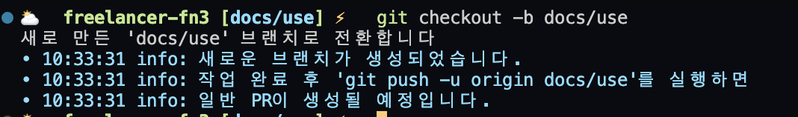
   *그림 1: 새 브랜치 생성 결과 - 브랜치가 생성되고 PR 생성을 위한 안내 메시지가 표시됩니다.*

2. 변경사항 커밋 및 푸시:
   ```bash
   autopr commit -a
   ```
   
   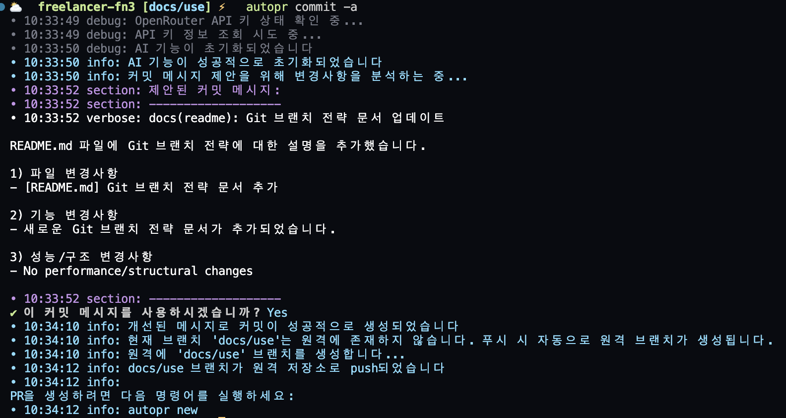
   *그림 2: 커밋 및 푸시 결과 - AI가 자동으로 커밋 메시지를 생성하고, 확인 후 원격 저장소로 변경사항이 푸시됩니다.*

### PR 생성 및 병합

3. PR 생성:
   ```bash
   autopr new
   ```
   
   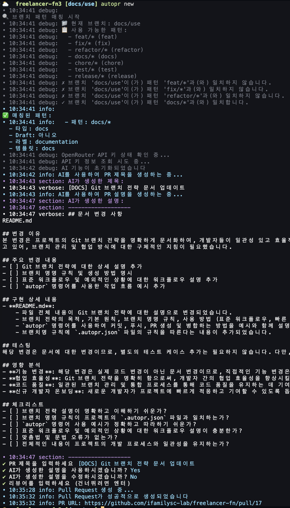
   *그림 3: PR 생성 결과 - 브랜치 패턴이 매칭되고, AI가 PR 설명을 생성한 후 GitHub에 PR이 생성됩니다.*

4. PR 병합:
   ```bash
   autopr merge 17  # 17은 위에서 생성된 PR 번호입니다
   ```
   
   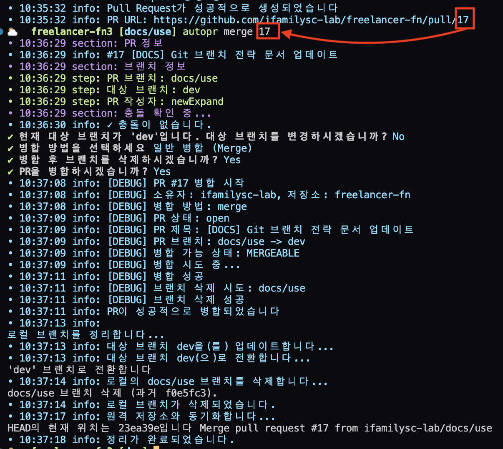
   *그림 4: PR 병합 결과 - PR 정보 확인, 충돌 검사 후 성공적으로 병합되고 로컬 브랜치가 정리됩니다.*

### GitHub PR 자동 리뷰

초기화 과정에서 GitHub Actions 워크플로우 설정을 선택한 경우, PR이 생성되거나 업데이트될 때 자동으로 코드 리뷰가 수행됩니다. 이 실험적 기능은 다음과 같은 장점을 제공합니다:

- PR 전체에 대한 종합적인 코드 리뷰 요약 제공
- 특정 코드 라인에 인라인 코멘트 자동 추가
- 코드 품질, 버그, 보안 문제 등을 자동으로 감지
- 사용자의 로케일 설정에 맞는 언어로 리뷰 제공

GitHub Actions 워크플로우는 `.github/workflows/pr-review.yml` 파일에 자동으로 생성되며, 추가적인 설정 없이 즉시 작동합니다.

### 릴리즈 브랜치 생성 및 병합

5. 릴리즈 브랜치 생성:
   ```bash
   git checkout -b release/merge
   ```
   
   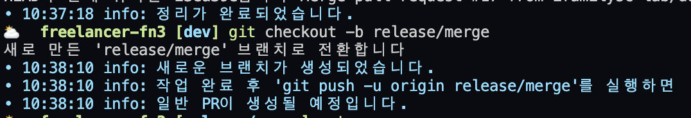
   *그림 5: 릴리즈 브랜치 생성 결과 - 새로운 릴리즈 브랜치가 생성되고 PR 생성을 위한 안내가 표시됩니다.*

6. 릴리즈 PR 생성:
   ```bash
   autopr new
   ```
   
   
   *그림 6: 릴리즈 PR 생성 결과 - release/* 패턴이 매칭되고 릴리즈용 PR이 생성됩니다.*

7. 릴리즈 PR 병합:
   ```bash
   autopr merge 18  # 18은 위에서 생성된 릴리즈 PR 번호입니다
   ```
   
   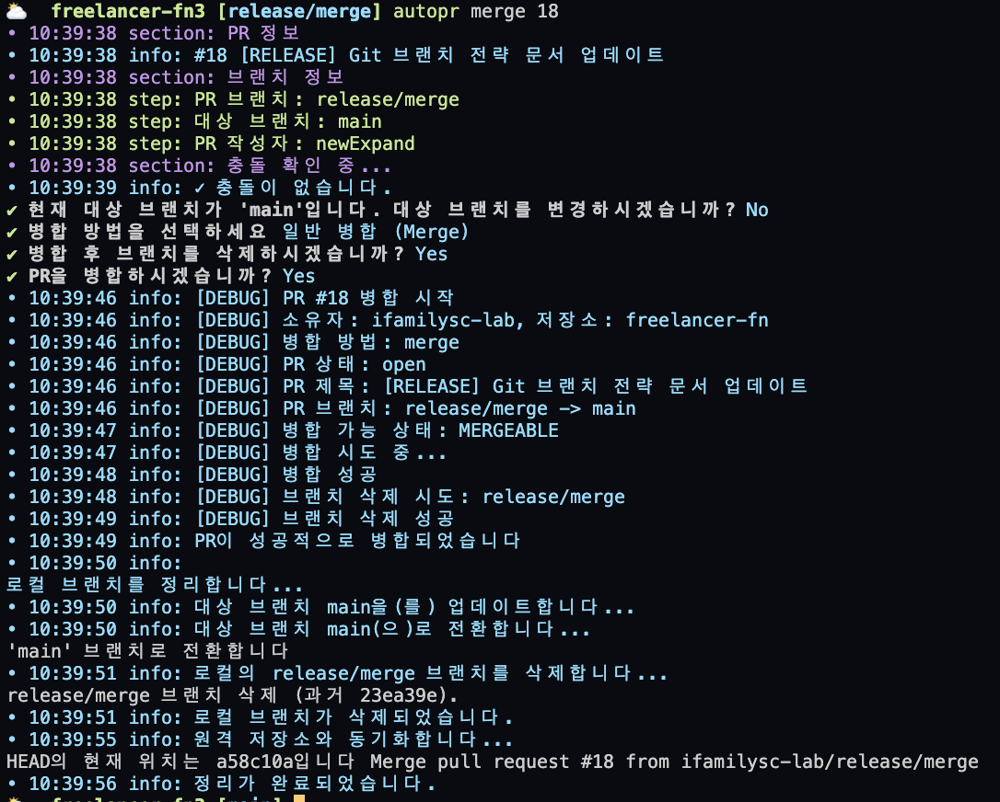
   *그림 7: 릴리즈 PR 병합 결과 - 릴리즈 PR이 성공적으로 main 브랜치에 병합되고 로컬 브랜치가 정리됩니다.*

> 💡 **참고**: `autopr` 명령어는 사용자 친화적인 메시지와 함께 작업 진행 상황을 상세히 표시합니다. 커밋 메시지 자동 생성, 브랜치 패턴 매칭, PR 생성 및 병합 등의 기능을 제공하여 작업 효율을 높입니다.

## 실제 PR 예시

실제로 AutoPR을 사용하여 생성한 PR의 예시는 다음 링크에서 확인할 수 있습니다:
[https://github.com/newExpand/github-autopr-cli/pull/56](https://github.com/newExpand/github-autopr-cli/pull/56)

위 PR은 `autopr` CLI 도구의 다음과 같은 주요 기능 개선 및 추가 사항을 포함합니다:
- 일일 커밋 보고서 기능
- PR 목록 기능 강화
- 커밋 프로세스 개선
- 충돌 해결 가이드 개선
- 사용자 인터페이스 개선

