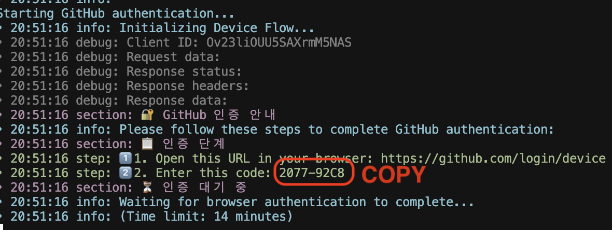
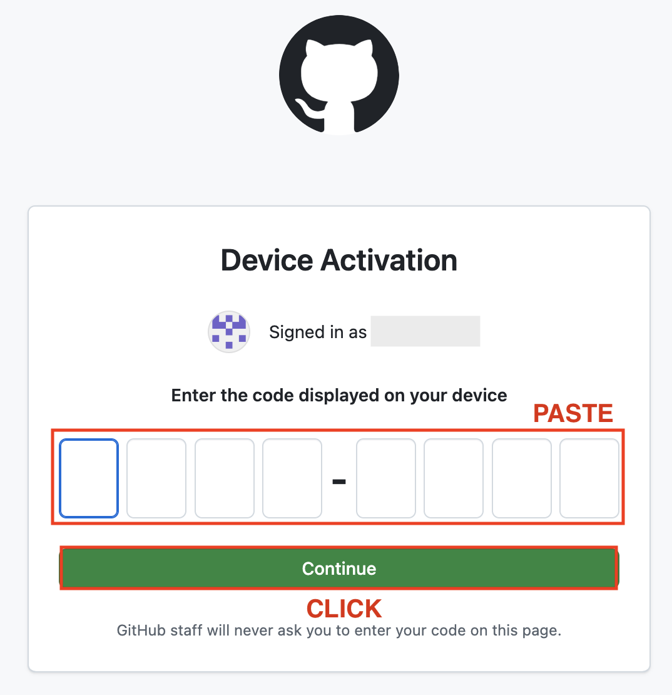
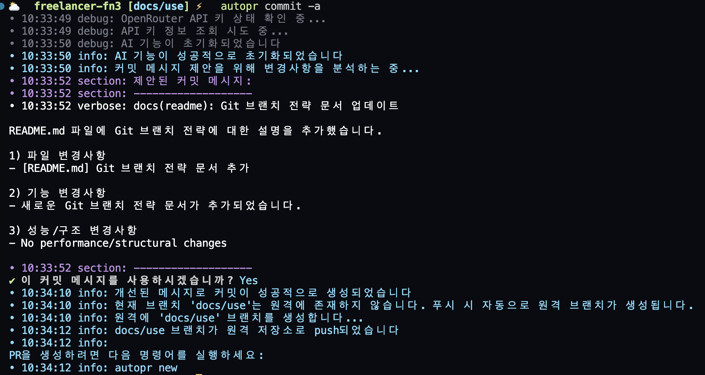
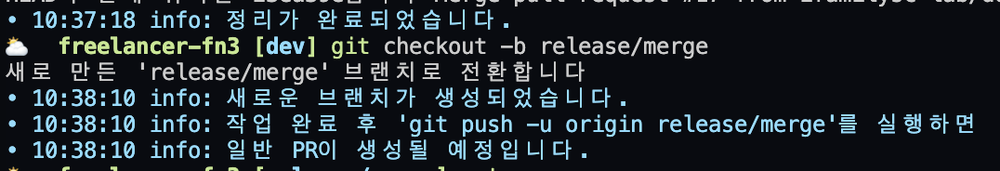
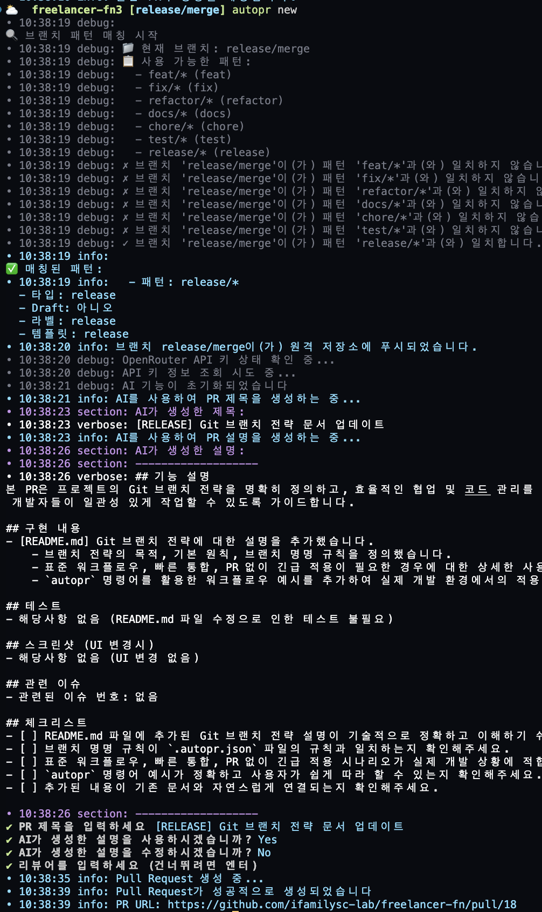

# Branch Strategy Guide Based on GitFlow

## Overview

This document explains the branch management strategy based on the GitFlow design pattern. GitFlow is a widely used branch management model in software development projects, introduced by Vincent Driessen in 2010.

The branch strategy of this library is based on "GitFlow", combined with elements of "GitHub Flow" and "Conventional Commits" to create a customized workflow. Managing each branch with PRs allows for clear tracking of project work and enables consistent integration into the `dev` and `main` branches.

### Key Features

- Separate management of main branch (`main`) and development branch (`dev`)
- Creating branches (`feat/*`) for each feature and merging into the development branch after completion
- Merging the content of the development branch into the main branch through release branches (`release/*`)
- Applying branch naming rules according to purpose: bug fixes (`fix/*`), refactoring (`refactor/*`), etc.
- Integration of commit message conventions (feat, fix, docs, etc.) and PR-based workflow
- Automation of workflow through AutoPR tool

## AutoPR Installation and Setup

To use the AutoPR tool, follow these steps for installation and setup:

1. Install globally via NPM:
   ```bash
   npm install -g newexpand-autopr // * Please proceed with npm only.
   ```

2. Run initial setup in your project:
   ```bash
   autopr init
   ```
   Running this command will display an interactive prompt where you can configure the default branches (main, dev, etc.) and branch patterns for your project.

   ### Initial Setup (init) Example
   
   Below are step-by-step screen examples when running the `autopr init` command:
   
   #### a. GitHub Token Setup
   
   
   *Initial setup start - Configure your GitHub token. You can choose between OAuth authentication or manual token entry.*
   
   #### b. GitHub Authentication 1
   
   
   *GitHub authentication process*
   
   #### c. GitHub Authentication 2
   
   
   *Access must be allowed for Organization-related repositories on GitHub (check for the green checkmark). Personal repositories can be used immediately upon clicking.*
   
   #### d. GitHub Authentication 3
   
   
   *Copy the device code from the terminal*

   #### e. GitHub Authentication 4
   
   
   *Apply the code copied from the terminal to the authentication code*
   
   #### f. AutoPr Basic Settings
   
   
   *Configure the project's default branch (main), development branch (dev), release PR template, default reviewers, etc.*
   
   #### g. Setup Complete
   
   
   *Initial setup has been successfully completed. You are now ready to use AutoPR.*

3. Check version and update:
   ```bash
   # Check currently installed version
   autopr --version
   
   # Check the latest version on npm
   npm view newexpand-autopr version
   
   # Update to the latest version
   npm install -g newexpand-autopr@latest
   ```

> 💡 **Note**: Users of previous versions can also update to the latest version using the commands above.

## Basic Principles

- Always develop and apply changes based on the `dev` branch first
- Integrate into `dev` whenever a branch-level feature is completed
- Integrate into `main` when the entire feature is completed
- Always merge the latest `dev` branch before creating a PR to resolve conflicts in advance
- Delete branches after integration to keep the repository clean

## Branch Naming Conventions

Following the rules in the `.autopr.json` file, use these formats:

- `feat/*`: New feature development
- `fix/*`: Bug fixes
- `refactor/*`: Code refactoring
- `docs/*`: Documentation changes
- `chore/*`: Miscellaneous tasks
- `test/*`: Test-related work
- `release/*`: Release preparation

How to create a branch:
```bash
git checkout -b <branch-name>
# Example: git checkout -b feat/notice-object-a
```

> 💡 **Note**: For longer branch names, use `-` as a separator.

## Usage

### Standard Workflow

1. Create a new feature branch from the `dev` branch
   ```bash
   git checkout dev
   git checkout -b feat/<feature-name>
   ```

2. Commit and push after working
   ```bash
   autopr commit -a  # Performs commit and push to origin together
   ```

3. Synchronize with the latest `dev` branch before creating a PR
   ```bash
   git checkout dev
   git pull origin dev
   git checkout feat/<feature-name>
   git merge dev
   # After resolving any conflicts
   autopr commit -a
   ```

4. Create a PR
   ```bash
   autopr new
   ```

5. Merge PR
   ```bash
   autopr merge <PR-number>  # Use the PR number displayed after running autopr new
   ```

6. Create and merge a release branch
   ```bash
   git checkout -b release/<version>
   autopr new
   autopr merge <PR-number>
   ```

### For Cases Requiring Quick Integration

1. Develop directly on the `dev` branch, then create a release branch
   ```bash
   git checkout dev
   # Perform development work
   git checkout -b release/<version>
   autopr new
   autopr merge <PR-number>
   ```

### When Only Commit Is Needed Without PR

Work directly on the `dev` or `main` branch:
```bash
autopr commit -a  # Commit and push to origin for the current branch
# Or
autopr commit  # Commit locally without pushing to origin
```

### autopr commit Command Options

The `autopr commit` command provides various options that can be used as needed:

```bash
autopr commit        # Stage and commit all changes (without push)
autopr commit -a     # Stage and commit all changes, then push to remote repository
autopr commit -s     # Selectively stage and commit changed files (without push)
autopr commit -sp    # Selectively stage and commit changed files, then push to remote repository
```

> 💡 **Note**: The `-s` option allows you to select which files to include in the commit, useful when working on multiple features simultaneously. The `-p` suffix automatically executes `git push` after committing.

## Branch Cleanup and Management

As development progresses actively, various branches are created, potentially complicating the repository. Cleaning up integrated branches offers these benefits:

- Maintains clarity of repository structure
- Improves visibility of ongoing work
- Enhances Git performance
- Prevents accidental work on outdated branches

### How to Delete Integrated Branches

1. Delete local branch:
   ```bash
   git branch -d <branch-name>  # Delete only merged branches (-d)
   git branch -D <branch-name>  # Force delete (regardless of merge status)
   ```

2. Delete remote branch:
   ```bash
   git push origin --delete <branch-name>
   ```

3. Automatic cleanup when using `autopr merge`:
   ```bash
   autopr merge <PR-number>
   ```
   > 💡 **Note**: The `autopr merge` command automatically deletes the branch locally after PR merge and checks out to the target branch (dev or main).

4. Periodic branch cleanup:
   ```bash
   # Delete all already merged local branches
   git fetch -p && git branch --merged | grep -v '\*\|master\|main\|dev' | xargs git branch -d
   
   # Clean up local references to deleted remote branches
   git fetch --prune
   ```

> 💡 **Note**: It's good practice to schedule periodic (e.g., bi-weekly) cleanup of unused branches with team members.

## Real Usage Examples

Below are the results of executing commands in an actual terminal.

### Creating and Committing to a Documentation Change Branch

1. Create a docs type branch:
   ```bash
   git checkout -b docs/use
   ```
   
   
   *Figure 1: New branch creation result - The branch is created and a guidance message for PR creation is displayed.*

2. Commit and push changes:
   ```bash
   autopr commit -a
   ```
   
   
   *Figure 2: Commit and push result - AI automatically generates a commit message, and after confirmation, changes are pushed to the remote repository.*

### Creating and Merging PR

3. Create PR:
   ```bash
   autopr new
   ```
   
   
   *Figure 3: PR creation result - Branch pattern is matched, AI generates PR description, and PR is created on GitHub.*

4. Merge PR:
   ```bash
   autopr merge 17  # 17 is the PR number created above
   ```
   
   
   *Figure 4: PR merge result - PR information confirmed, conflict check performed, successfully merged, and local branch cleaned up.*

### Creating and Merging Release Branch

5. Create release branch:
   ```bash
   git checkout -b release/merge
   ```
   
   
   *Figure 5: Release branch creation result - New release branch is created and guidance for PR creation is displayed.*

6. Create release PR:
   ```bash
   autopr new
   ```
   
   
   *Figure 6: Release PR creation result - release/* pattern is matched and a release PR is created.*

7. Merge release PR:
   ```bash
   autopr merge 18  # 18 is the release PR number created above
   ```
   
   
   *Figure 7: Release PR merge result - Release PR is successfully merged into the main branch and local branch is cleaned up.*

> 💡 **Note**: The `autopr` commands display detailed work progress with user-friendly messages. They provide features such as automatic commit message generation, branch pattern matching, PR creation and merging, enhancing work efficiency.

## Real PR Example

You can check out a real PR example created using AutoPR at the following link:
[https://github.com/newExpand/github-autopr-cli/pull/56](https://github.com/newExpand/github-autopr-cli/pull/56)

This PR includes the following major feature improvements and additions to the `autopr` CLI tool:
- Daily commit report feature
- Enhanced PR list functionality
- Improved commit process
- Enhanced conflict resolution guide
- Improved user interface
